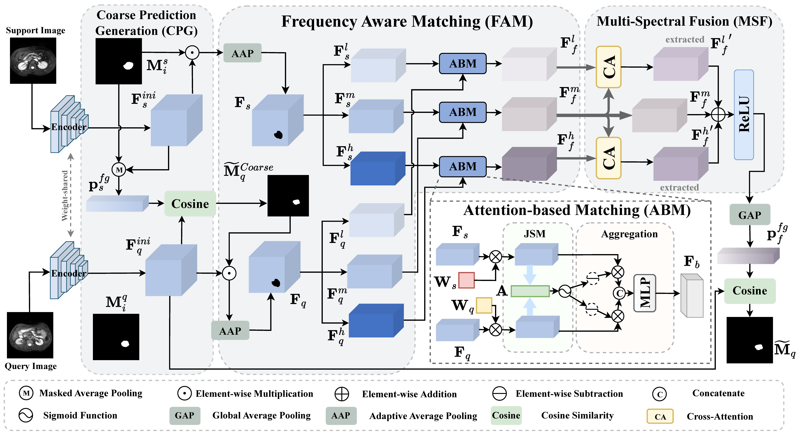

# FAMNet
Official code for paper: FAMNet: Frequency-aware Matching Network for Cross-domain Few-shot Medical Image Segmentation




#### Abstract
Existing few-shot medical image segmentation (FSMIS) models fail to address a practical issue in medical imaging: the domain shift caused by different imaging techniques, which limits the applicability to current FSMIS tasks. To overcome this limitation, we focus on the cross-domain few-shot medical image segmentation (CD-FSMIS) task, aiming to develop a generalized model capable of adapting to a broader range of medical image segmentation scenarios with limited labeled data from the novel target domain.
Inspired by the characteristics of frequency domain similarity across different domains, we propose a Frequency-aware Matching Network (FAMNet), which includes two key components: a Frequency-aware Matching (FAM) module and a Multi-Spectral Fusion (MSF) module. The FAM module tackles two problems during the meta-learning phase: 1) intra-domain variance caused by the inherent support-query bias, due to the different appearances of organs and lesions, and 2) inter-domain variance caused by different medical imaging techniques. Additionally, we design an MSF module to integrate the different frequency features decoupled by the FAM module, and further mitigate the impact of inter-domain variance on the model's segmentation performance.
Combining these two modules, our FAMNet surpasses existing FSMIS models and Cross-domain Few-shot Semantic Segmentation models on three cross-domain datasets, achieving state-of-the-art performance in the CD-FSMIS task.


# Getting started

### Dependencies
Please install following essential dependencies:
```
dcm2nii
json5==0.8.5
jupyter==1.0.0
nibabel==2.5.1
numpy==1.22.0
opencv-python==4.5.5.62
Pillow>=8.1.1
sacred==0.8.2
scikit-image==0.18.3
SimpleITK==1.2.3
torch==1.10.2
torchvision=0.11.2
tqdm==4.62.3
```


### Date sets and Pre-processing
Download:
1) **Abdominal MRI**: [Combined Healthy Abdominal Organ Segmentation data set](https://chaos.grand-challenge.org/)
2) **Abdominal CT**: [Multi-Atlas Abdomen Labeling Challenge](https://www.synapse.org/#!Synapse:syn3193805/wiki/218292)
3) **Cardiac LGE and b-SSFP**: [Multi-sequence Cardiac MRI Segmentation data set](https://zmiclab.github.io/projects/mscmrseg19/)
4) **Prostate UCLH and NCI**: [Cross-institution Male Pelvic Structures](https://zenodo.org/records/7013610)

Pre-processing is performed according to [Ouyang et al.](https://github.com/cheng-01037/Self-supervised-Fewshot-Medical-Image-Segmentation/tree/2f2a22b74890cb9ad5e56ac234ea02b9f1c7a535) and we follow the procedure on their github repository.


### Training
1. Compile `./data/supervoxels/felzenszwalb_3d_cy.pyx` with cython (`python ./data/supervoxels/setup.py build_ext --inplace`) and run `./data/supervoxels/generate_supervoxels.py`
2. Download pre-trained ResNet-50 weights [vanilla version](https://download.pytorch.org/models/fcn_resnet50_coco-1167a1af.pth) or [deeplabv3 version](https://download.pytorch.org/models/deeplabv3_resnet50_coco-cd0a2569.pth) and put your checkpoints folder, then replace the absolute path in the code `./models/encoder.py`.  
3. Run `./script/train_<direction>.sh`, for example: `./script/train_ct2mr.sh`


### Inference
Run `./script/test_<direction>.sh` 

### Acknowledgement
Our code is based the works: [SSL-ALPNet](https://github.com/cheng-01037/Self-supervised-Fewshot-Medical-Image-Segmentation), [ADNet](https://github.com/sha168/ADNet) and [QNet](https://github.com/ZJLAB-AMMI/Q-Net)


